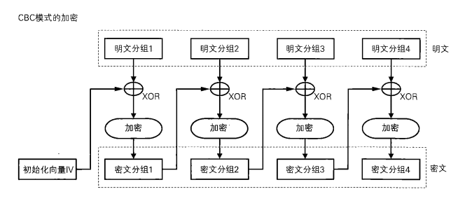
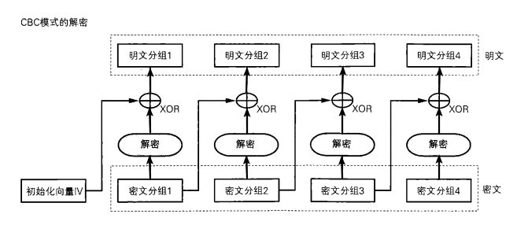
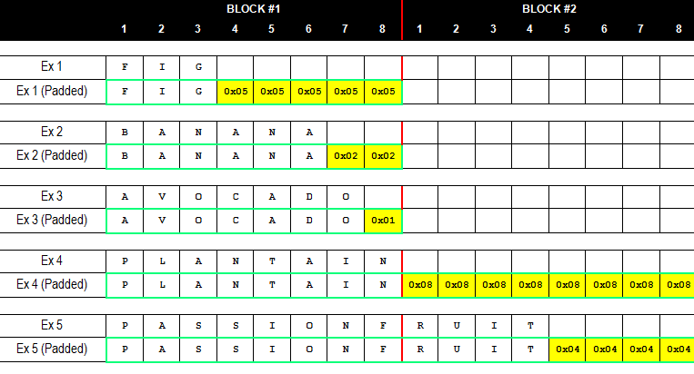
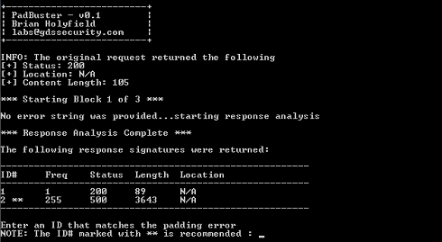
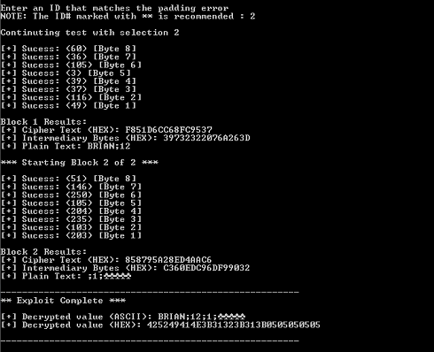
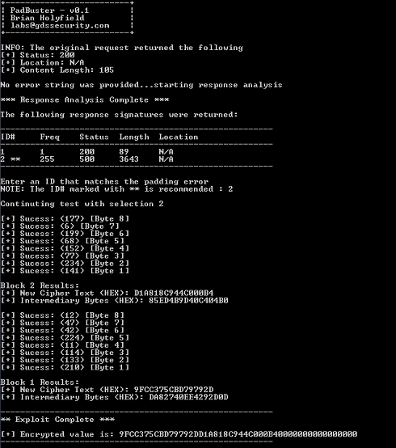
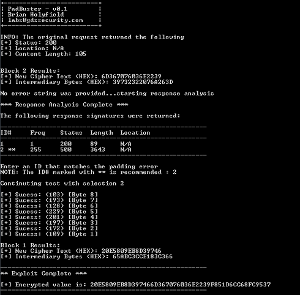

#Padding Oracle Attack基本介绍#

Radding Oracle攻击是一种用于解密数据并重新加密任意数据的攻击手段，主要应用于CBC模式。此外，Radding Oracle Attack在2011年的Pwnie Rewards上还被评为”最具价值的服务器漏洞”。

# CBC模式介绍 #
CBC模式是密文分组链接模式，目的是为了使原本独立的分组密码加密过程形成迭代，使每次加密的结果影响到下一次加密。这行可以强化加密算法的”敏感性”，即实现所谓的”雪崩效应”，在香浓理论中这就是“扰乱原则”。

## 1. CBC加密流程 ##

## 2. CBC解密流程 ##

# 填充 #
- 填充Oracle攻击背后的一个关键概念是加密填充的概念。明文消息有多种长度; 但是，分组密码要求所有消息都是精确数量的块。为了满足这一要求，填充用于确保给定的明文消息总是可以被分成精确数量的块。

- 填充方案有多种，但PKCS7是最常见的填充方案之一。使用PCKS7填充时，最后的明文块用N个字节（取决于最后一个明文块的长度）填充。并且，填充将由相同的数字组成，例如明文缺少3个字节，则填充将为\x03\x03\x03。

- 注意:
至少有一个填充字节始终附加到字符串的末尾，因此7字节值（如AVOCADO）将填充0x01以填充块，而8字节值（如PLANTAIN）将具有添加了完整的填充块。填充字节的值也表示字节数，因此逻辑上最后一个密文块末尾的最终值必须是：
 - 单个0x01字节（0x01）
 - 两个0x02字节（0x02,0x02）
 - 三个0x03字节（0x03,0x03,0x03）
 - 四个0x04字节（0x04,0x04,0x04,0x04）
 - 等等...
  
- 如果最终解密的块没有以这些有效字节序列之一结束，则大多数加密提供程序将抛出无效的填充异常。抛出此异常这一事实对于攻击者（我们）来说至关重要，因为它是填充oracle攻击的基础。
# 基本填充Oracle攻击情形 #
应用程序使用查询字符串参数来传递用户的加密数据。该参数使用CBC模式加密，并且每个值使用预先设置的唯一初始化向量（IV）。

当应用程序传递加密值时，它以三种方式之一响应：

- 当收到有效的密文（一个正确填充并包含有效数据的密文）时，应用程序正常响应
- 当收到无效的密文时（解密后，密文不会以有效填充结束），应用程序将引发加密异常
- 当收到有效的密文（正确填充的密文）但解密为无效值时，应用程序会显示自定义错误消息
# Padding Oracle攻击的具体过程 #
## 1. 解密 ##

- 如何使用PadBuster来执行此漏洞利用？这个过程中PadBuster有三个参数：
 - URL - 这是我们要利用的URL，包括查询字符串（如果存在）。有可选的开关提供POST数据（-post）和Cookie（如果需要）（-cookies）
 - 加密样本 - 这是请求中包含的加密密文样本。此值还必须存在于URL，post或cookie值中，并且将在每个测试请求时自动替换
 - 块大小，即密码正在使用的块的大小，通常是8或16（两个都可以试试）。

- 以下示例，使用指定加密样本的编码方式。默认情况下，PadBuster是Base64编码的，但在此示例中，加密文本被编码为大写ASCII HEX字符串。指定编码（-encoding）的选项采用以下三个可能值之一：
 - 0：Base64（默认）
 - 1：小写的HEX ASCII
 - 2：大写十六进制ASCII

- 此外，PadBuster没有定义如何识别填充错误。虽然有一个命令行选项（-error）来指定填充错误消息，但默认情况下，PadBuster将会分析测试响应的第一个周期（0-256），并提示选择哪个响应模式与填充异常匹配。通常，只有两种响应模式可供选择，如下所示（PadBuster将建议使用哪一种）。  

- PadBuster的初始输出显示在上面的屏幕截图中。我们能看到PadBuster重新发出原始请求，并在开始测试之前显示生成的响应信息。这对于经过身份验证的应用程序非常有用，可确保提供给PadBuster的身份验证Cookie正常运行。

- 一旦选择了响应模式，PadBuster将自动循环遍历每个块，并强制每个相应的明文字节强制执行，每个字节最多需要256个请求。在每个块之后，PadBuster还将显示获得的中间字节值以及计算的明文。在执行任意加密漏洞时，中间值能起到一个大作用。

##2. 加密 ##
使用相同的漏洞加密任意有效负载（我们想要加密的明文）

- 从算法或流程中我们可以知道，一旦我们能够推导出给定密文块的中间值，我们就可以操纵IV值，以便完全控制密文被解密的值。
- 对于单个块，在第一个密文块的前一个示例中，如果希望块解密为“TEST”值，则可以通过将期望的明文与中间值进行异或来计算生成此值所需的IV。因此字符串“TEST”（用四个0x04字节填充）将与中间值进行异或，以产生所需的IV。
- 当构造多个块时，从最后一个块开始并向后移动以生成有效的密文。
- 一旦我们强制中间价值，就可以操纵IV以产生我们想要的任何文本。然后可以将新IV预先设置为前一个样本，从而产生我们选择的密文。该过程可以无限次重复以加密任何长度的数据。

PadBuster加密任意值

- PadBuster可以选择自动创建任意加密值的过程。有三个与创建密文有关的命令行开关：
 - plaintext [String]：这是要加密的纯文本。使用PadBuster加密数据时，此选项是必需的，它的存在是告诉PadBuster执行加密而不是解密
 - ciphertext [Bytes]：用于中间字节的CipherText（十六进制编码），可用于提供用于加密的起始密文块。此选项必须与-intermediary选项一起使用
 - intermediary [Bytes]：CipherText的中间字节数（Hex-Encoded），可用于使用-ciphertext选项指定的密文提供相应的中间字节值。
- ciphertext和-intermediary的目的是加速利用过程，因为它减少了生成伪造密文样本时必须破解的密文块的数量。如果未提供这些选项，PadBuster将从头开始并强制执行所有必要的加密块。                          

- 就像之前一样，PadBuster首先要求我们选择正确的填充错误响应签名。如果使用-error选项手动指定填充错误消息，则可以跳过此步骤。另外，我们没有指定要使用的起始密文块和相关的中间值，如果我们将这些值提供给PadBuster，则第一个块将立即计算，第二个块需要强行破解，如下所示  

- 在提示响应签名之前计算了第一个块（块2），因为该块仅使用-ciphertext和-intermediary选项提供的数据计算。如果想知道这两个值来自何处，可以在PadBuster每轮块处理结束时将这两个值打印出来。
# 总结和感悟 #
1. Padding Oracle Attack的条件：
 - 攻击者能够获得密文以及初始化向量IV。
 - 攻击者能够触发密文的解密过程，且能够知道密文的解密结果，如果解密后不满足 padding （一般用pkcs7）服务端会报错. 
2. 我们要搞清楚的是攻击方向是什么（我们在攻击什么）？在Padding Oracle Attack中，攻击者输入的参数是IV+Cipher，我们要通过对IV的"穷举"来请求服务器端对我们指定的Cipher进行解密，并对返回的结果进行判断。
3. 算法关键点
 - 填充字节，即明文不足分组长度时，进行填充的字节。
 - 填充错误。利用padding error来不断测试是此攻击的重点。
4. 编写自动化代码时考虑的返回参数情况
 - 参数是一串正确的密文，分组、填充、加密都是对的(程序运行本身没出问题)，包含的其他内容也是正确的，那么服务端解密、检测用户权限都没有问题。
 - 参数是一串错误的密文，包含不正确的填充(程序运行本身出现错误)，则服务端解密时就会抛出异常。
 - 参数是一串正确的密文(程序运行本身没出问题)，包含的用户名是错误的，那么服务端解密之后显示不通过。
# 附件 #
1. [自动化代码](padding.py)（python版，未完成，有大量自己的注释，可用于充分了解此攻击）
2. [padbuster](padbuster.pl) 工具代码 （perl）
